# Image analysis of genetically encoded reporters using MATScopeSuite

*Jin Zhang Lab, Department of Pharmacology, UC San Diego*

*Last updated: 25 October 2021*
 
## Contents
1.	System Requirements
2.	Installation Guide
3.	Instructions for Use and Demo

### System Requirements
The program has been tested using the following operating systems:
- Mac OS 11.3.1 64-bit, Windows 10.0.19042 64-bit
- MATLAB versions 2018a, 2021a
- MATLAB toolboxes required to run every component of the packaged software:
  - Image Acquisition
  - Image Processing
  - Statistics and Machine Learning
### Installation Guide
1.	Download the MATScope analysis software package from [Github](https://github.com/jinzhanglab-ucsd/MatScopeSuite)
2.	Extract zip file
3.	Move the demo data file “DemoDish” out of the MatScope-main folder
    - *“DemoDish” contains data from an imaging done with wildtype mouse embryonic fibroblasts expressing ExRai AMPKAR and treated with 2-deoxyglucose at 4 min (image 10)*
4.	Add the ‘MatScopeSuite-main’ directory to the current path in MATLAB, either by copying the unzipped folder to the current path and adding the folder and subfolders to the current path or navigating to the unzipped folder in the MATLAB folder window and adding the folder and subfolders to the current path.
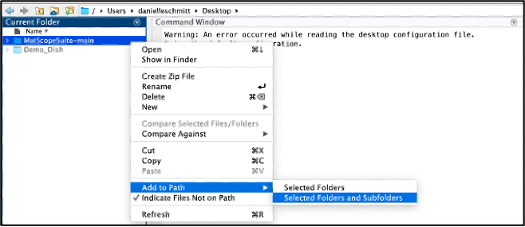
5.	In the path box, navigate to the location containing the file “DemoDish”
6.	In the Current Folder window, double click on the MATLAB file beginning with the file name “LUres_Dish1_1_181026.mat” and this script will open in the Editor.
    - *Approximate time: <1 min*
### Instructions for use and Demo
Data was collected for analysis using [MatScope](https://github.com/buffavaholic/MATscope/wiki/Setup) and compiled for analysis using [MatScopeSuite](https://github.com/jinzhanglab-ucsd/MatScopeSuite).
1.	Line 7, “path = ‘\…” copy and paste the path directory in the path window between the single apostrophes 
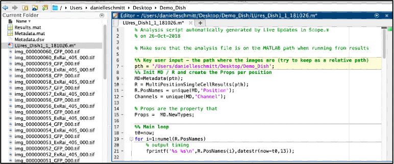
    - *Already existing in this script is code which will perform background subtraction*
 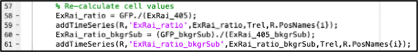
    - *The script also contains code to normalize to one by normalizing to the first few time points before drug addition and generate graphs of the un-normalized and normalized data*
 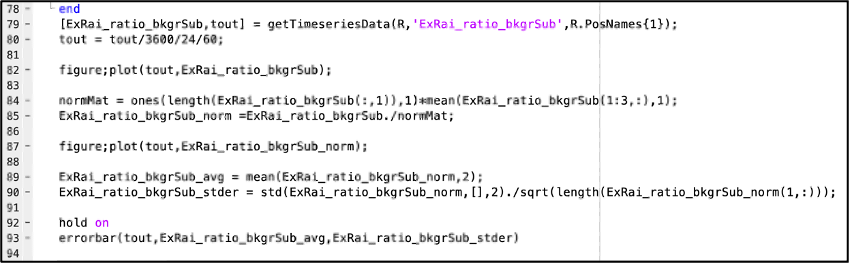
2.	In Command Window, type “StackROIgui" and hit the enter key
    - *If you have not added the MATScope scripts to the path you will get an error that reads “Undefined function or variable ’StackROIgui'”*
 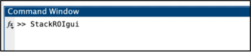
3.	A window will pop up with one button “Select Image Folder”. Click this button
 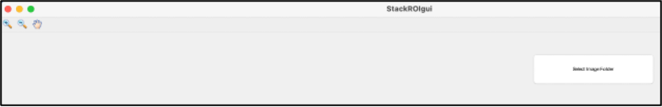
4.	Another window will pop up with the MATLAB file labeled “Metdata.mat” selected. If you have the correct path open, this will be the metadata in the imaging file you are currently analyzing. Open this folder
 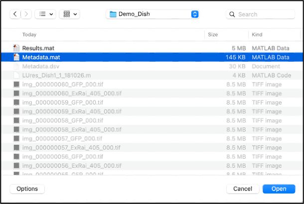
    - *When the folder is opening, this status will appear:*
 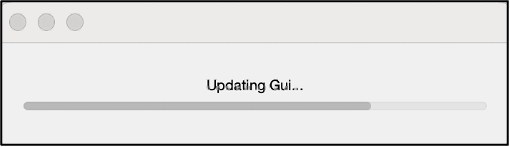
 
5.	This will now change the existing window to allow you to select the channel or “Image Stack” you want to analyze. Select the channel and click “Get Image Stack". For ExRai biosensors, since the 405 nm channel is initially brighter, analysis should be done with this channel.
 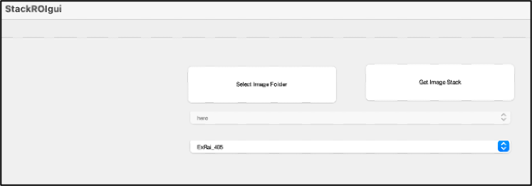
6.	A GUI for selection of ROIs will now appear. Select ROIs and use the scroll bar at the bottom to make sure the ROIs stay centered. You can use arrow buttons to move ROIs, skip frames, and move all ROIs at the same time. You can also change how many pixels each ROI moves. When you are done, click “Save ROIs and Analyze". Time for this will depend on how long it takes the user to select cells.
 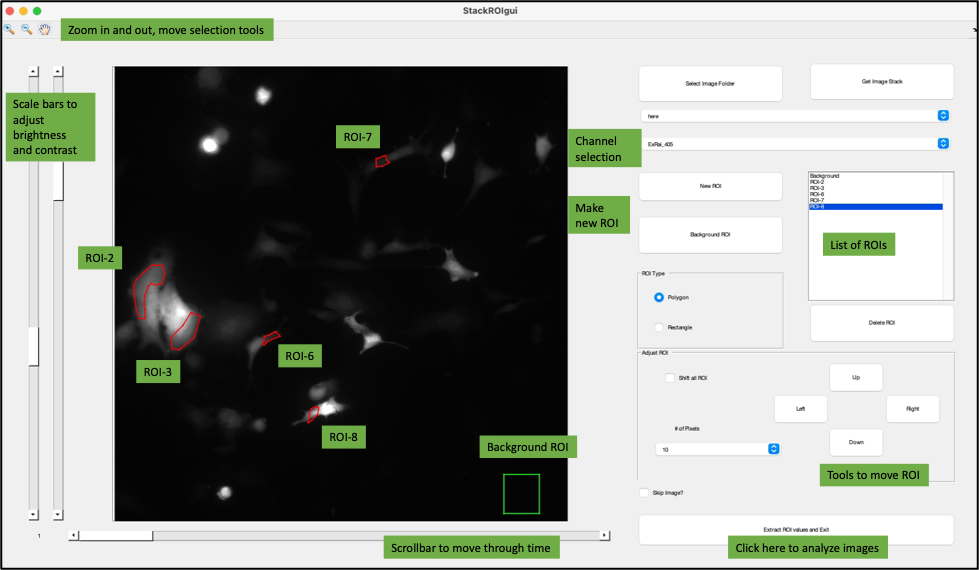
    - To make a new ROI, select either polygon or rectangle ROI type, and then select “New ROI”. A crosshair will appear. 
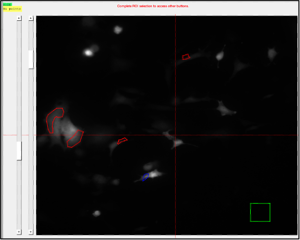

      - For polygon selection, left click around region of cell of interest, outlining the area. Once outline is complete, right click to close the ROI.
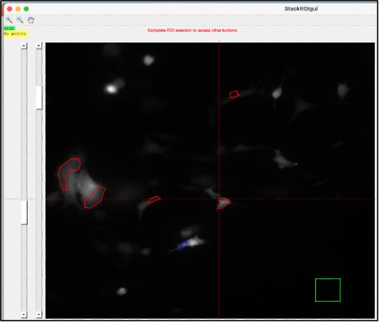

      - For rectangle selection, define two corners to define the region of interest, this will create a rectangle ROI.
7.	Depending on your computer and the data, this will take approximately 62 sec to run the LUres_Dish1_1_181026.m script for 122 images with 11 ROIs. When finished, two graphs will appear. Each cell is an individual trace. One graph is the normalized data, and one graph is un-normalized data.  
A progress window will appear during data analysis and the command window will update as data is analyized.
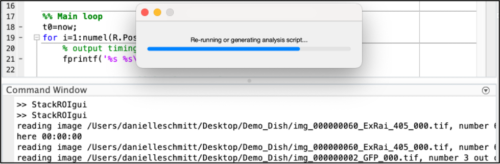
 
    - Un-normalized data (Figure 1)
 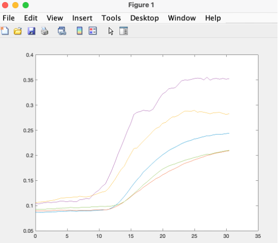
    - Normalized data (Figure 2)
 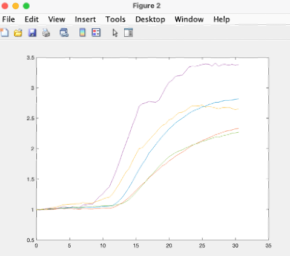
8.	Under workspace, double click the file name that ends with “bkgr_Sub_norm” this will produce a spreadsheet of the normalized data. Copy and paste this into Excel for further analysis. To get the time, double click on “tout".

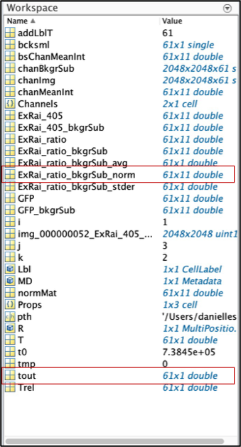
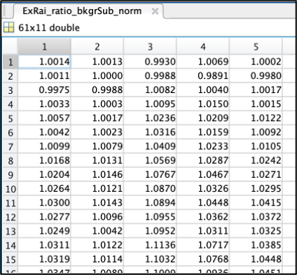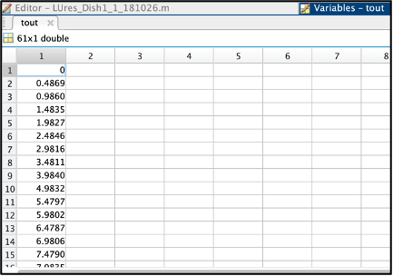
 

  

